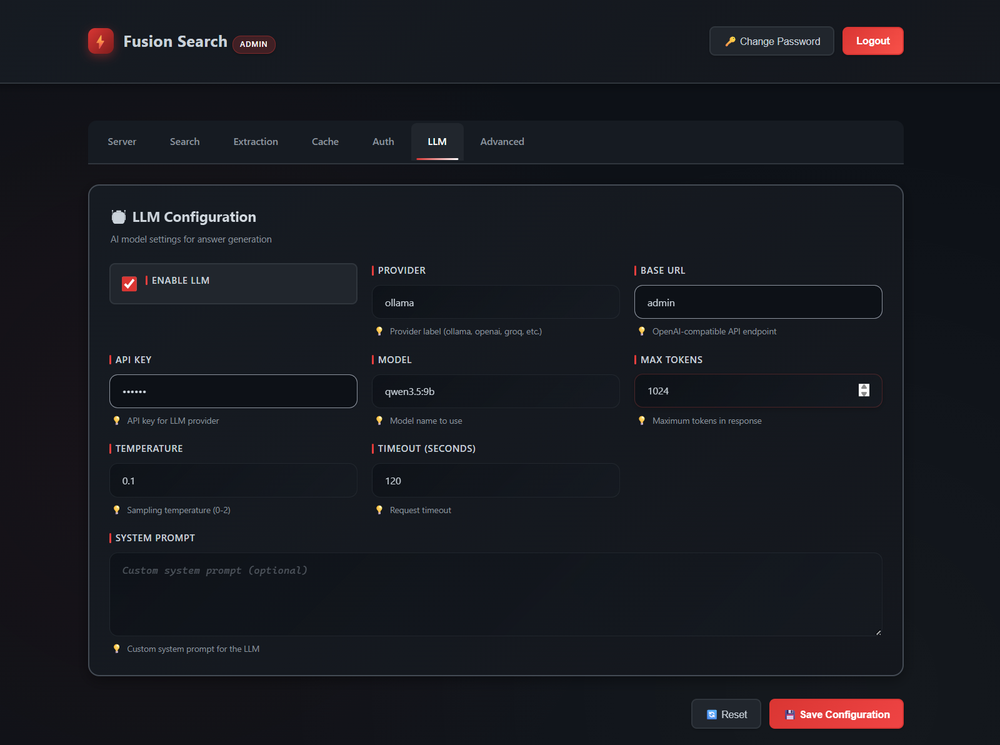

# FusionSearch - Go Implementation

This is a Go implementation of the FusionSearch API, equivalent to the Python version but using the Go ecosystem with Gin framework.

## Architecture

The Go implementation follows the same architecture as the Python version:

```
goapp/
├── config/           # Configuration management
├── logging/          # Structured logging with Zap
├── middleware/       # HTTP middleware (auth, rate limiting, timing, request ID)
├── models/           # Data models/schemas
├── routers/          # HTTP route handlers (search, extract, search_stream)
├── services/         # Business logic services
│   ├── cache.go         # Redis cache service
│   ├── extractor.go     # Content extraction service
│   ├── llm.go           # LLM answer generation service
│   └── search_backend.go # Search backend (SearXNG, DuckDuckGo)
└── main.go           # Application entry point
```

## Key Differences from Python Version

### Framework & Libraries
- **Web Framework**: FastAPI → Gin
- **Logging**: structlog → Zap
- **HTTP Client**: httpx → net/http
- **Redis Client**: redis.asyncio → go-redis/redis
- **LLM Client**: openai Python SDK → go-openai
- **CORS**: FastAPI CORSMiddleware → gin-contrib/cors

### Concurrency Model
- **Async/Await**: Python asyncio → Go goroutines and channels
- **Semaphores**: asyncio.Semaphore → buffered channels
- **Task Groups**: asyncio.gather → sync.WaitGroup / goroutines

### Content Extraction
- Python uses `trafilatura` and `readability-lxml` libraries
- Go version implements a simpler HTML-to-text extraction using regex
- For production, consider using Go ports of these libraries or external services

### Reranking
- Go version supports local ONNX reranking (cross-encoder) with ONNX Runtime
- Recommended model: `cross-encoder/ms-marco-MiniLM-L12-v2` ONNX artifacts

### Search Backends
- SearXNG backend is fully implemented
- DuckDuckGo backend is a placeholder (would need external library or API)

## Building and Running

### Prerequisites
- Go 1.21 or later
- Redis (for caching and rate limiting)
- SearXNG instance (for search backend)

### Build
```bash
cd goapp
go build -o fusion-search .
```

### Run
```bash
./fusion-search
```

The server will start on `0.0.0.0:8000` by default.

### Configuration
Same `config.yaml` file as the Python version, or set `FUSION_SEARCH_CONFIG` environment variable.

## API Endpoints

All endpoints are identical to the Python version:

- `POST /search` - Search the web
- `POST /extract` - Extract content from URLs
- `POST /search/stream` - Stream search results with SSE
- `GET /health` - Health check
- `GET /tool-schema` - OpenAI-compatible tool schema

## Admin Console

Fusion Search includes a built-in admin console for configuration management.

- Admin page: `GET /admin`
- Login API: `POST /admin/api/login`
- Config APIs: `GET /admin/api/config`, `PUT /admin/api/config`



## Features

✅ Configuration management with YAML
✅ Structured logging with Zap
✅ Request ID tracking
✅ Request timing middleware
✅ CORS support
✅ API key authentication
✅ Rate limiting with Redis
✅ Search caching with Redis
✅ SearXNG search backend
✅ Content extraction from URLs
✅ LLM answer generation (OpenAI-compatible)
✅ Server-Sent Events (SSE) for streaming
✅ Graceful shutdown
✅ Health check endpoint

⚠️ **Partial/Placeholder**:
- DuckDuckGo backend (needs external library)
- Content extraction (simplified HTML-to-text, not as advanced as trafilatura)

## Performance Considerations

The Go version should provide:
- Better concurrency handling with goroutines
- Lower memory overhead
- Faster startup time
- Better performance under high load

## Production Recommendations

1. **Content Extraction**: Integrate with a proper HTML extraction library or service
2. **Reranking**: Implement neural reranking using an external ML API
3. **DuckDuckGo**: Use a proper DDGS library or proxy service
4. **Circuit Breaker**: Add circuit breaker pattern for external services
5. **Metrics**: Add Prometheus metrics for monitoring
6. **Tracing**: Add OpenTelemetry for distributed tracing
7. **Rate Limiting**: Consider using a more sophisticated rate limiting library

## License

Same license as the original Python implementation.
